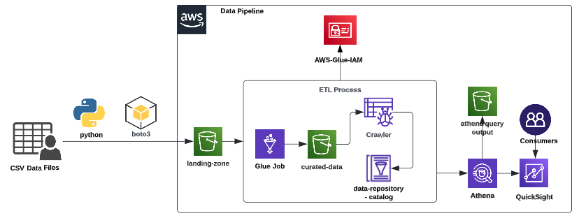

# Enterprise-Grade ETL Data Pipeline with AWS  

## Overview  
This project demonstrates how to design and implement **production-grade ETL pipelines** leveraging **AWS Cloud-native services** and **Python**. The solution automates ingestion, transformation, and delivery of clean, reliable, and analytics-ready datasets to enable **data-driven decision-making** across the organization.  

Unlike traditional ETL solutions that only move data, this architecture embeds **data quality validation**, **monitoring**, and **alerting mechanisms** to ensure that downstream analytics and business intelligence systems operate on trusted and consistent data. By doing so, organizations reduce operational inefficiencies, mitigate risks from bad data, and accelerate **time-to-insight**.  

---

## 🏗️ Data Architecture  

  

### Key Architectural Features  

- **Data Ingestion**  
  - Raw data is ingested from file systems and external sources using **Python-based loaders**.  
  - Files are persisted in **Amazon S3 (Landing Zone)** for cost-efficient and durable storage.  

- **ETL with AWS Glue**  
  - Data is extracted from the S3 landing zone.  
  - Mandatory data quality checks ensure schema conformity and validation.  
  - Transformations include **cleaning, standardization, normalization, and enrichment**.  
  - Processed datasets are loaded into the **S3 Curated Zone**, making them analytics-ready.  

- **Data Orchestration**  
  - End-to-end workflow automation using **AWS Glue Workflows**.  
  - Pipelines are scheduled, monitored, and retried automatically to guarantee timeliness and reliability.  

- **Logging & Alerting**  
  - Centralized logging provides complete visibility into pipeline execution.  
  - **Proactive alerting** ensures data engineers and business stakeholders are notified of anomalies or failures in real-time.  

- **Analytics & Visualization**  
  - Data in the curated zone is queried using **Amazon Athena** (serverless SQL).  
  - Insights are visualized in **Amazon QuickSight**, empowering business teams with interactive dashboards.  

- **Infrastructure as Code (IaC)**  
  - Entire pipeline infrastructure (S3, Glue jobs, Glue crawlers, IAM roles, etc.) is provisioned using **AWS CloudFormation** templates.  
  - Ensures **repeatability, consistency, and rapid deployment** across multiple environments (Dev, QA, Prod).  

---

## Business Value  

- **Operational Efficiency**: Automated pipelines reduce manual intervention, lowering costs and minimizing human error.  
- **Data Trustworthiness**: Built-in validation ensures only clean and accurate data flows into decision-making systems.  
- **Scalability**: Cloud-native design enables handling of **large and diverse data sources** without infrastructure overhead.  
- **Faster Time-to-Insight**: Business teams can query curated data and generate insights on-demand.  
- **Governance & Transparency**: Comprehensive logging and monitoring improve compliance, auditability, and accountability.  

---

## Installation & Setup  

### 1. Install Dependencies  
```bash
pip install -r requirements.txt
```


### 2. Change the following parameter values in **glue-etl-process.py** file
    - region: AWS REGION
    - source_file_path: ENTER YOUR S3 BUCKET PATH
    - target_file_path: ENTER YOUR S3 BUCKET PATH
    - glueCrawler_name: This name should match the name mentioned in aws-artifacts-creation.yaml file

### 3. Change the following parameter values in **upload-file-s3.py** file
    - local_file_path: Your local dataset file path 
    - bucket_name: S3 Bucket Name
    - s3_file: S3 Bucket Prefix(Directory structure)

### 4. Before running the CF template, change the following paramter values in **aws-artifacts-creation.yaml** file
    - AWSIAMRoleName
    - AWSGlueJobName:
    - AWSGlueCrawlerName:
    - AWSGlueCatalogName:
    - AWSGlueJobTriggerName:
    - GlueJobScriptLocation: Glue Job Script S3 bucket path
    - CrawlerS3Path: curated-data S3 bucket path 
